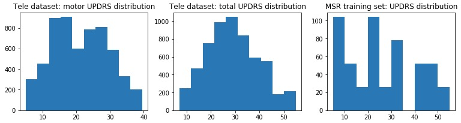
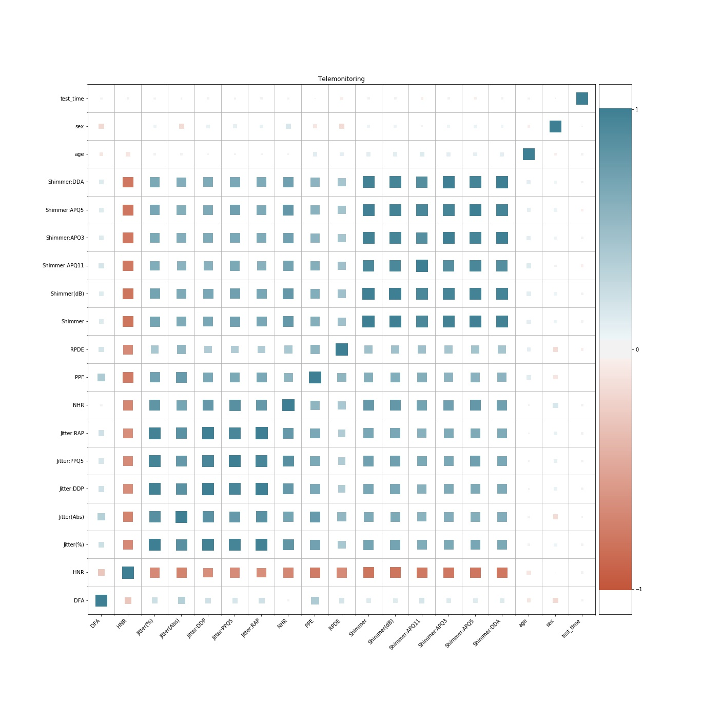
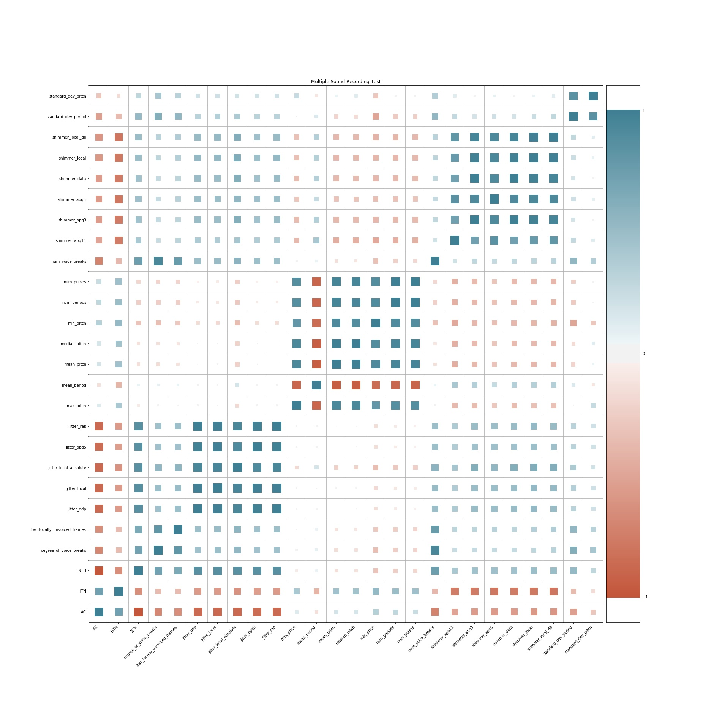
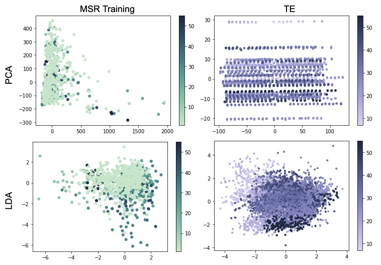

## Introduction and Motivation
Parkinson’s disease (PD) is the most common neuro-degenerative movement disorder [1]. Characterized by the degradation of dopaminergic neurons, PD patients develop severe motor symptoms and cognitive impairment. Unfortunately, treatment options for PD symptoms do not reverse the underlying neuronal degradation and disease progression [1]. Currently, the best method of defense against PD is early detection. However, patients are often diagnosed with PD by severe motor dysfunction, occurring around 80% degeneration of dopamine neurons [2]. Therefore, it is important to diagnose PD before its advancement to preserve neuron integrity and slow progression.

One strategy for early detection of PD is speech pattern recognition. PD vocal dysfunction may be identified 5 years before traditional diagnoses by changes including, reduced volume and tongue flexibility, narrow pitch range, and long pauses [3]. In this project, we used various speech-related data sets to classify and predict PD disease severity.

## Data Description
The aim of this project is to predict Parkinson's presence, and disease severity. The Unified Parkinson Disease Rating Scale (UPDRS) is a rating tool used to understand the course of PD in patients. The UPDRS scale is used for determining treatment strategies and for PD clinical research purposes. The scale includes ratings for PD symptoms and is comprised of 6 parts:
1. Mentation, Behavior, and Mood
2. Activities of Daily Living
3. Motor Examination
4. Complications of Therapy
5. Modified Hoehn and Yahr Scale
6. Schwab and England Activities of Daily Living Scale

UPDRS scores range from 0 to 199, with 199 representing the greatest disease severity, or total disability [4].

We include two datasets in our project as the training data. We use MSR or the combination of TE and MSR for predicting Parkinsons's presence, and we use TE or the MSR/TE combination for predicting disease severity (UPDRS).

### [Multiple Sound Recording (MSR) Dataset](https://archive.ics.uci.edu/ml/datasets/Parkinson+Speech+Dataset+with++Multiple+Types+of+Sound+Recordings) [5]

##### Training data
The training data were gathered from 20 patients with Parkinsons and 20 healthy individuals. Multiple types of sound recordings were taken from each participant (listed below) and expert physicians assigned each participant a Unified Parkinson's Disease Rating Scale (UPDRS) score.

**Utterances**
* 1: sustained vowel (“a”)
* 2: sustained vowel (“o”)
* 3: sustained vowel (“u”)
* 4-13: numbers from 1 to 10
* 14-17: short sentences
* 18-26: words

**Features Training Data File:**
* column 1: Subject id
* columns 2-27: features
* features 1-5: Jitter (local), Jitter (local, absolute), Jitter (rap), Jitter (ppq5), Jitter (ddp),
* features 6-11: Shimmer (local), Shimmer (local, dB), Shimmer (apq3), Shimmer (apq5), Shimmer (apq11), Shimmer (dda)
* features 12-14: AC,NTH,HTN
* features 15-19: Median pitch, Mean pitch, Standard deviation, Minimum pitch, Maximum pitch
* features 20-23: Number of pulses, Number of periods, Mean period, Standard deviation of period
* features 24-26: Fraction of locally unvoiced frames, Number of voice breaks, Degree of voice breaks
* column 28: UPDRS
* column 29: class information

##### Testing data
The testing data were gathered from 28 different patients with Parkinsons. The patients are asked to say only the sustained vowels 'a' and 'o' three times each, producing 168 recordings. The same 26 features are extracted from the voice samples.

**Utterances**
* 1-3: sustained vowel (“a”)
* 4-6: sustained vowel (“o”)

### [Telemonitoring (TE) Dataset](http://archive.ics.uci.edu/ml/datasets/Parkinsons+Telemonitoring) [6]
The data was gathered from 42 people with early-stage Parkinson's disease. There are 16 voice measures, and two regression measurements: motor UPDRS and total UPDRS. Each row of the dataset contain corresponds to one voice recording. There are around 200 recordings per patient, the subject number of the patient is identified in the first column.

**Features**
* subject# - Integer that uniquely identifies each subject
* age - Subject age
* sex - Subject gender '0' - male, '1' - female
* test_time - Time since recruitment into the trial. The integer part is the number of days since recruitment.
* motor_UPDRS - Clinician's motor UPDRS score, linearly interpolated
* total_UPDRS - Clinician's total UPDRS score, linearly interpolated
* Jitter(%), Jitter(Abs), Jitter:RAP, Jitter:PPQ5, Jitter:DDP - Several measures of variation in fundamental frequency
* Shimmer, Shimmer(dB), Shimmer:APQ3, Shimmer:APQ5, Shimmer:APQ11, Shimmer:DDA - Several measures of variation in amplitude
* NHR,HNR - Two measures of ratio of noise to tonal components in the voice
* RPDE - A nonlinear dynamical complexity measure
* DFA - Signal fractal scaling exponent
* PPE - A nonlinear measure of fundamental frequency variation

### Dataset Comparison

Dataset | Data Points | Features 
------------ | ------------- | -------------
Multiple Sound Recoring Training | 1040 | 29
Multiple Sound Recoring Testing | 168 | 28
Telemonitoring | 5875 | 22

We note that the TE dataset has over 5 times as many data points as the MSR data sets. In our experiment, we use MSR and TE for training both classification and regression models. 

### Response data: UPDRS
Although TE and MSR have different UPDRS score distributions, their score range is similar. As a result, we merge these two datasets together by their common features to build another, larger training dataset.
Distributions of UPDRS scores:

## Intial Data Exploration & Unsupervised Learning

### Covariance Matrices

First we will begin by creating visualizations for the correlation matrix of each dataset. We will be using a special heatmap that encodes correlation using not only color, but size. The code for this visualization is taken from this [tutorial](https://towardsdatascience.com/better-heatmaps-and-correlation-matrix-plots-in-python-41445d0f2bec).

#### Telemonitoring

#### Multiple Sound Recording
These datasets have two separate train and test datasets. The data are drawn from very different distributions of people: the training dataset comes from a mix of people with and without Parkinson's, and the testing dataset is entirely composed of data collected from people with Parkinson's.
We can graph the covariance matrix of both datasets and see if they differ.

##### Training Data Set

###### Testing Data Set

### Dimension Reduction:
Each dataset has many features, and from the covariance matrices we see that some features are highly correlated, so let's try doing some dimensionality reduction using PCA and LDA.

Let's begin by using PCA on the datasets and seeing how many components we need to recover 99% of the variance.

#### Principal Component Analysis

Dataset | # of Features | Reduced # of Components
------------ | ------------- | -------------
Disease Classification | 755 | 270
Multiple Sound Recoring Training | 29 | 17
Multiple Sound Recoring Testing | 28 | 12
Telemonitoring | 22 | 11

We can see a great reduction in the number of components describing 99% of the variance in these datasets.

Now, let's visualize the first two components of the TE and MSR train dataset. We've colored datapoints by the UPDRS score, a measure of PD severity.

## Supervised Learning & Prediciton of PD
### Datasets
For this section, we explored the prediction of PD in the MSR testing set from 1) the MSR training set and 2) an aggregated TE and MSR training data set.

For the latter, we found 13 overlapping features: Jitter, Jitter(Abs), Jitter:RAP, Jitter:PPQ5, Jitter:DDP, Shimmer, Shimmer(dB), Shimmer:APQ3, Shimmer:APQ5, Shimmer:APQ11, Shimmer:DDA, NHR, and HNR. We reduced the MSR training set and TE datasets to these features and performed predictions.

### Classification: PD and non-PD patients

At this point, we used the MSR training set and the aggregated set to train binary classification models and tested them on the MSR testing set. In the testing set, all of the samples have PD. Our goal is to identify the accuracy of diagnose PD disease among these patients. We also compare performance on different algorithm. As shown in the following table, Naive Bayes can achieve the best result when using MSR training set. Moreover, after combining both sets, our accuracy improved for each classifier. However, there is also a concern here that samples with and without disease are very imbalanced in the combined set. The improvement might be caused by overfitting.

#### Accuracy of each classifier:

Classifier | MSR Train | MSR Train & TE
------------ | ------------- | -------------
Random Forest Classifier | 57.1% | 100%
Decision Tree | 61.3% | 80.4%
Naïve Bayes | 84.5% | 86.9%
Neural Network | 65.5% | 100%

#### SVM Classifier:

Kernel | MSR Train | MSR Train & TE
------------ | ------------- | -------------
Linear | 51.7% | 100%
RBF | 54.1% | 99.4%
Poly | 79.8% | 96.4%

### Regression: UPDRS scores

Since we have UPDRS scores for the MSR training dataset and the TE dataset, we wanted to test if we could predict these scores with different regression models. We first explore the TE dataset for training our models and then use the TE and MSR training combined set. This time, the combined data set will be normalized (l2 norm) before using the supervised learning algorithms. For both, we only choose patients with Parkinson disease for our training data. To evaluate our result, we utilize the evaluation method proposed by the original paper, which split 10% and 90% data from TE dataset for 10 fold cross-validation and report the Mean Absolute Error (MAE) at the testing subset.

#### Training on TE

We report the best result proposed by the original paper, which used Jitter(Abs), :Shimmer, NHR, HNR,
DFA, and PPE as the training features and Classification And Regression Tree (CART) as the model. In our experiment, we leveraged different feature processing methods for pre-processing our training data. We compare three methods 1) using original features 2) log transformation of the features and 3) PCA feature reduction. The results are shown in the followng table. We also tried various regression models and report the best two models (Random Forest Regressor and Extra Trees Regressor) here. By using Extra Trees Regressor and PCA dimension reduction, we can achieve an MAE score 4.38, which shows PCA has the ability to effectively improve the accuracy of these regressors and capture feature correlation.

Method | feature | MAE
------------ | ------------- | -------------
Best result proposed by paper | log transform | 7.52±0.25
Random Forest Regressor | original data | 6.46
Extra Trees Regressor | original data | 6.41
Random Forest Regressor | log transform | 6.42
Random Forest Regressor | PCA | 4.81
Extra Trees Regressor | PCA | 4.38

#### Training on TE & MSR combination

We also try to train our regression model with the aggregated set. 

Method | Features | MAE
------------ | ------------- | -------------
Random Forest Regressor | original data | 8.56
Extra Trees Regressor | original data | 8.3
Random Forest Regressor | PCA | 8.08
Extra Trees Regressor | PCA | 8.16

While the accuracies of the models trained on the joint dataset are worse, this is almost certainly due to the inherent differences in the two datasets. The TE dataset has over 100s of samples from each individual over time, while the MSR dataset has significantly less. Furthermore, the MSR dataset has participants say a preselected set of phrases, while the TE dataset is a collection of varying and unscripted phrases from participants. It is possible that this mix of data leads to a more generalized, better model, but more experiment needs to be done to determine this.

#### Neural Network Regression

We also decided to try building some neural network models to test their efficacy. Due to the relatively low feature space and number of data points, we assumed they may be less effective than some other classical methods, but they ended up being just as effective if tuned properly. 

We initially assumed that the neural network should be a single hidden layer deep, to handle a lack of linear seperability but to also prevent overfitting. We tried many different hidden layer sizes, with the joint dataset and PCA preprocessing. The results are shown below:

Hidden Layer Size | MAE
------------ | -------------
10 | 8.71
20 | 8.64
50 | 8.66
100 | 8.43
200 | 8.34
500 | 8.36
1000 | 8.36

Since none of these networks beat our prior results, we decided to try neural networks with two hidden layers. The results were very impressive!

Hidden Layer 1 Size | Hidden Layer 2 Size | MAE
------------ | ------------- | -------------
100 | 50 | 8.36
200 | 100 | 8.31
500 | 200 | 8.22
1000 | 500 | 8.07

Running the two-layer networks on the TE dataset, we get even more impressive results:

Hidden Layer 1 Size | Hidden Layer 2 Size | MAE
------------ | ------------- | -------------
100 | 50 | 3.27
200 | 100 | 3.31
500 | 200 | 3.24
1000 | 500 | 3.14

With more time, we would like to do some exploration on why neural networks with two layers and many nodes work better on these datasets. 

## Applying our Models to Available Data
One of the larger open datasets is the Mozilla Foundation's [Common Voice](voice.mozilla.org) dataset. It has 2454 hours of sound recordings spanning 29 languages. The data is published under C-0 license, which means all data is public domain.

To reduce the data-points processed, the models were only tested on validated American-English recordings. Furthermore, since Parkinson's symptoms typically first manifest around the age of 50, all recordings from people ages 39 and younger were filtered out, to allow for some leeway. This left us with 46,813 sentence-long sound files.

### Dataset Composition
Total Samples: 46,813

Age | Number of Samples
------------ | -------------
40's | 21,824
50's  | 10,700
60's | 12,299
70's  | 1,661
80's  | 276
90's  | 53

### Results
#### Classifier Predictions (MSR Train & TE):

Classifier | Prediction
------------ | -------------
Random Forest Classifier | Insert Percent%
Decision Tree | Insert Percent%
Naïve Bayes |  Insert Percent%
Neural Network |  Insert Percent%

#### SVM Predictions by Kernel:

Kernel | Prediction
------------ | -------------
Linear | Insert Percent%
RBF  | Insert Percent%
Poly | Insert Percent%

### Discussion
What does this tell us about our models?

## References
[1] Rascol, O.,Payoux, P.,Ory, F.,Ferreira, J. J., Brefel-Courbon, C. and Montastruc, J. (2003), Limitations of current Parkinson's disease therapy. Ann Neurol., 53: S3-S15.

[2] Pagan, F. L., (2012). Improving outcomes through early diagnosis of Parkinson’s disease. The American Journal of Managed Care, 18, 176-182.

[3] Vaiciukynas, E., Verikas, A., Gelzinis, A., & Bacauskiene, M. (2017). Detecting Parkinson's disease from sustained phonation and speech signals. PloS one, 12(10), e0185613. doi:10.1371/journal.pone.0185613

[4] UPDRS SCALE [Internet]. Theracycle. PD Resources; [cited 2019Nov16]. Available from: https://www.theracycle.com/pd-resources/links-and-additional-resources/updrs-scale/

[5] Erdogdu Sakar, B., Isenkul, M., Sakar, C.O., Sertbas, A., Gurgen, F., Delil, S., Apaydin, H., Kursun, O., 'Collection and Analysis of a Parkinson Speech Dataset with Multiple Types of Sound Recordings', IEEE Journal of Biomedical and Health Informatics, vol. 17(4), pp. 828-834, 2013.

[6] Tsanas, A., Little, M. A., McSharry, P. E., & Ramig, L. O. (2009). Accurate telemonitoring of Parkinson's disease progression by noninvasive speech tests. IEEE transactions on Biomedical Engineering, 57(4), 884-893.
